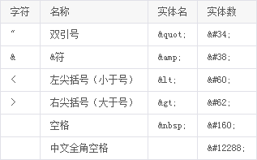
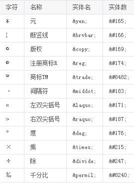

HTML规范 - 内容语义
==============

#####内容类型决定使用的语义标签#####
在网页中某种类型的内容必定需要某种特定的HTML标签来承载，也就是我们常常提到的根据你的内容语义化HTML结构。

#####加强“资源型”内容的可访问性和可用性
在资源型的内容加上描述的文案，比如给img添加alt属性，在audio内加入文案和链接等等。

#####加强“不可见”内容的可访问性#####
背景图上的文字应该同时写在html中，并使用css使其可见，有利于所搜引擎抓取你的页面，也可以在css失效的情况下看到内容。

#####适当使用实体#####
以实体替代与HTML语法相同的字符，避免浏览器解析错误。

常用HTML实体（建议使用实体）

常用特殊字符实体（不建议使用实体）

