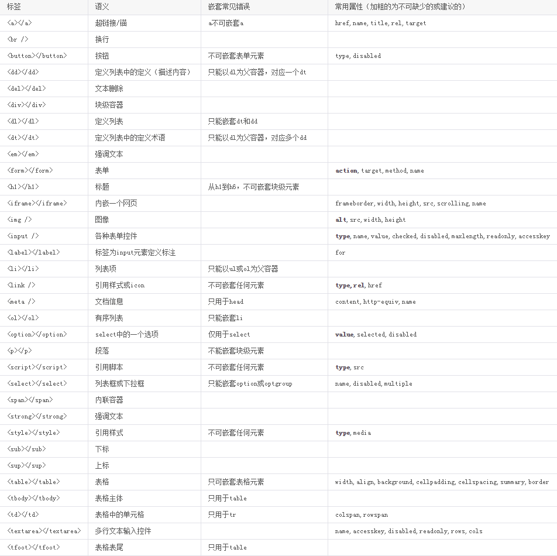
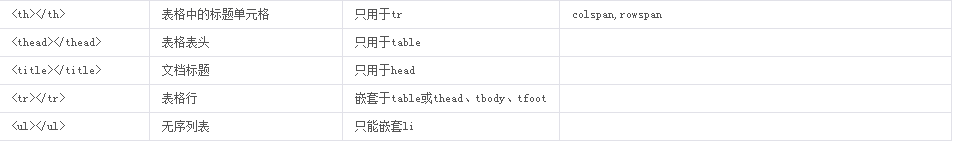

HTML规范 - 代码格式
==============
#####说明文案的注释方法#####
采用类似标签闭合的写法，与HTML统一格式；注释文案两头空格，与CSS注释统一格式。

*	开始注释：<\!-- 注释文案 --> （文案两头空格）。
*	结束注释：<\!-- /注释文案 -->	 （文案前加“/”，类似标签的闭合）。
*	允许只有开始注释

>
```html
	<!-- 头部 -->
	<div class="g-hd">
	    <!-- LOGO -->
	    <h1 class="m-logo"><a href="#">LOGO</a></h1>
	    <!-- /LOGO -->
	    <!-- 导航 -->
	    <ul class="m-nav">
	        <li><a href="#">NAV1</a></li>
	        <li><a href="#">NAV2</a></li>
	        <!-- 更多导航项 -->
	    </ul>
	    <!-- /导航 -->
	</div>
	<!-- /头部 -->
```
#####代码本身的注释方法#####
单行代码的注释也保持同行，两端空格；多行代码的注释起始和结尾都另起一行并做缩进对齐。
>
```html
	<!-- <h1 class="m-logo"><a href="#">LOGO</a></h1> -->
	<!--
	<ul class="m-nav">
	    <li><a href="#">NAV1</a></li>
	    <li><a href="#">NAV2</a></li>
	</ul>
	-->
```
#####HTML注释在IE6中的BUG
*	如果两个浮动元素之间存在注释，阿么可能导致布局错位或文字BUG。
*	所以，这种情况下，我们通常将注释去掉，或者索性采用模板语言（ftl、vm）的注释。

#####严格的嵌套#####
*	尽可能以严格的xhtml strict标准来嵌套，比如内敛元素不能包含块级元素等等。
*	正确闭合标签且必须闭合。
#####严格的属性#####
*	属性和值全部小写，每个属性都必须有一个值，每个值都必须加双引号。
*	没有值的属性必须使用自己的名称作为值（ckecked、disabled、readonly、selected等等）。
*	可以省略style标签和script标签的type属性。
#####常用标签#####
常见标签：


